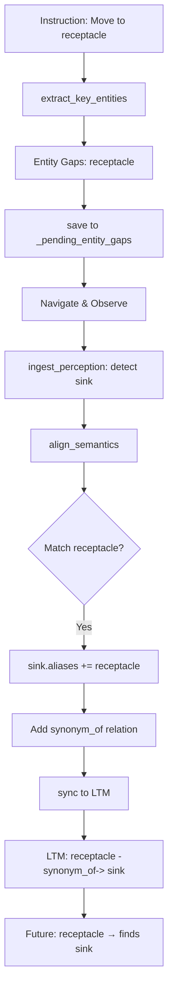

# 语义对齐与知识图谱系统

## 概述

本文档描述了 EmbodiedBench 中实现的**语义对齐和知识积累机制**，使 agent 能够：
1. 从指令中识别抽象术语（如 "receptacle"）
2. 通过观察建立与具体物体（如 "sink"）的映射关系
3. 将这些映射持久化到 LTM 知识图谱中
4. 在未来的任务中复用这些知识

## 核心场景示例

### 场景1：初次遇到抽象术语

```
Instruction: "Move a spatula from the right counter to the right receptacle of the left counter"

Step 1: prepare_planner_context
  - 提取实体: ["spatula", "right counter", "right receptacle", "left counter"]
  - 检测 Entity Gaps: ["entity:object:spatula", "entity:place:right receptacle", ...]
  - 保存到 _pending_entity_gaps

Step 2: Navigate to "left counter in kitchen"

Step 3: ingest_perception (观察到图片)
  - 检测到对象: ["sink", "counter", "faucet", ...]
  - 语义对齐: align_semantics()
    * 匹配: "receptacle" (abstract) → "sink" (concrete)
    * WM 更新: sink.aliases.append("receptacle")
    * 添加关系: sink -[synonym_of]-> receptacle
  - 同步到 LTM: 持久化别名和关系

Step 4: 未来任务
  - Instruction: "Put the cup in the receptacle near the left counter"
  - Entity Gap Detection: "receptacle" 通过别名匹配找到 "sink"
  - LTM 路径查询: receptacle → sink → left_of → counter
  - 直接导航到 sink！
```

## 架构设计

### 1. 数据结构

#### SemanticSymbol 增强
```python
@dataclass
class SemanticSymbol:
    type_candidates: List[TypeCandidate]
    state_vars: Dict[str, Any]
    relations: List[RelationSpec]
    conditions: List[Dict[str, Any]]
    constraints: List[Dict[str, Any]]
    aliases: List[str]  # ✨ 新增：同义词/别名列表
```

#### 关系类型定义
```python
SEMANTIC_RELATIONS = {
    # Spatial relations
    "left_of": "spatial",
    "right_of": "spatial", 
    "on": "spatial",
    "in": "spatial",
    
    # Semantic relations
    "synonym_of": "semantic",  # receptacle <-> sink
    "is_a": "semantic",        # sink is_a receptacle
    "part_of": "semantic",     # faucet part_of sink
}

ABSTRACT_TO_CONCRETE_HINTS = {
    "receptacle": ["sink", "basin", "bowl", "container", "bin"],
    "container": ["box", "basket", "bag", "bin", "jar"],
    "surface": ["counter", "table", "desk", "shelf"],
    "appliance": ["microwave", "oven", "stove", "refrigerator"],
}
```

### 2. 核心组件

#### 2.1 Entity Gap Detection（实体缺口检测）

**位置**: `MemoryOperatorEngine._detect_missing_entities_in_goal()`

**功能**:
- 从 goal 提取关键实体（使用 ACTION_ENTITY_PATTERNS + 介词模式）
- 与 WM 中已存在的节点对比（包括别名）
- 生成缺失实体列表: `["entity:kind:label", ...]`

**增强的实体提取**:
```python
# 新增模式匹配 "Move X from Y to Z"
ACTION_ENTITY_PATTERNS = [
    (re.compile(r"^(?:move)\s+(?:a|an|the\s+)?(?P<label>\w+(?:\s+\w+)*?)\s+from\s+"), "object"),
    ...
]

# 介词模式支持嵌套（处理 "of the left counter"）
prep_patterns = [
    r"from\s+(?:the\s+)?(?P<label>[\w\s]+?)(?:\s+to|\s+of|$)",
    r"to\s+(?:the\s+)?(?P<label>[\w\s]+?)(?:\s+of|$)",
    r"of\s+(?:the\s+)?(?P<label>[\w\s]+?)(?:\s+and|[,.]|$)",
]
```

#### 2.2 Semantic Alignment（语义对齐）

**位置**: `MemoryOperatorEngine.align_semantics()`

**触发时机**: 每次 `ingest_perception` 后

**流程**:
```python
def align_semantics(pending_gaps, observed_labels, step):
    for gap in pending_gaps:  # "entity:object:receptacle"
        gap_label = extract_label(gap)  # "receptacle"
        
        # 查找抽象→具体映射
        concrete_hints = ABSTRACT_TO_CONCRETE_HINTS.get(gap_label, [])
        
        # 在观察中匹配
        for obs_label in observed_labels:  # ["sink", "counter", ...]
            if obs_label in concrete_hints:
                # 找到映射！
                unit = find_unit_by_label(obs_label)
                unit.aliases.append(gap_label)  # sink.aliases = ["receptacle"]
                unit.relations.append(
                    RelationSpec(relation="synonym_of", target=gap_label, ...)
                )
                return alignment_record
```

**效果**:
- WM 中 "sink" 节点获得别名 "receptacle"
- 未来检索 "receptacle" 时可以通过别名匹配到 "sink"

#### 2.3 WM → LTM 同步

**位置**: `LTMService.ingest_wm_digest()`

**增强功能**:
```python
def ingest_wm_digest(wm_snapshot, ...):
    for digest in wm_snapshot:
        node, created = _upsert_node(label, kinds, ...)
        
        # ✨ 同步别名
        aliases = digest.get("aliases", [])
        for alias in aliases:
            # 1. 保存到节点属性
            node.attributes["aliases"].append(alias)
            
            # 2. 为别名创建独立节点
            alias_node = _upsert_node(label=alias, ...)
            
            # 3. 建立 synonym_of 关系
            _link_nodes(node.id, alias_node.id, "synonym_of", ...)
        
        # ✨ 同步关系（spatial + semantic）
        for rel in digest.get("relations", []):
            relation_type = rel["relation"]  # "left_of", "synonym_of", ...
            _link_nodes(node.id, target.id, relation_type, ...)
```

**持久化**:
- LTM 存储到 `outputs/semantic_memory/ltm_store.json`
- 跨 episode 复用知识

#### 2.4 LTM 路径查询

**位置**: `LTMService.query_relation_path()`

**用途**: 在 LTM 知识图谱中查找两个实体之间的关系路径

**示例**:
```python
path_result = ltm.query_relation_path(
    start_label="receptacle",
    target_label="left counter",
    max_depth=3
)

# 返回结果
{
    "found": True,
    "path": [
        (receptacle_id, sink_id, 0.95, "synonym_of"),
        (sink_id, counter_id, 0.8, "left_of")
    ],
    "confidence": 0.76,
    "path_description": "synonym_of(receptacle → sink) → left_of(sink → left counter)"
}
```

**算法**: BFS 广度优先搜索，考虑关系置信度

### 3. 匹配增强

#### 别名匹配支持

**位置**: `SemanticWMGraph.match_candidate()` 和 `find_unit_by_label()`

```python
def find_unit_by_label(label, kind=None):
    for unit in candidates:
        # 1. Primary label 匹配
        score = string_similarity(label, unit.primary_label())
        
        # 2. ✨ 别名匹配
        for alias in unit.aliases:
            alias_score = string_similarity(label, alias)
            score = max(score, alias_score)
        
        if score > best_score:
            best_unit = unit
    
    return best_unit if best_score >= 0.6 else None
```

**效果**:
- 搜索 "receptacle" 时能匹配到 label="sink", aliases=["receptacle"] 的节点
- Entity Gap Detection 也会检查别名集合

## 工作流程

### 完整生命周期



### 日志示例

```
[Entity Extraction] Pattern matched: ^(?:move)\s+(?:a|an|the\s+)?(?P<label>\w+...) -> 'spatula'
[Entity Extraction] Prep pattern matched: from\s+... -> 'right counter'
[Entity Extraction] Prep pattern matched: to\s+... -> 'right receptacle'
[Entity Extraction] Prep pattern matched: of\s+... -> 'left counter'
[Entity Extraction] Final extracted entities: ['spatula', 'right counter', 'right receptacle', 'left counter']

[Entity Gap Detection] Key entities extracted: ['spatula', 'right counter', 'right receptacle', 'left counter']
[Entity Gap Detection] Existing labels in WM (with aliases): ['bike', 'sofa', 'strawberry', ...]
[Entity Gap Detection] Entity 'receptacle' NOT found -> gap: entity:place:right receptacle

[SemanticMemoryManager] Entity gaps detected: ['entity:place:right receptacle', ...]

[Perception] Detected objects: ['sink', 'counter', 'microwave', ...]

[Semantic Alignment] Aligned 'receptacle' -> 'sink' (confidence=0.95)
[SemanticMemoryManager] Semantic alignment: 1 mappings established
  - 'receptacle' → 'sink' (conf=0.95)

[SemanticMemoryManager] Synced 8 WM nodes to LTM (stats={'aliases': 1, 'edges': 2, ...})
```

## API 使用示例

### 示例1：基本流程

```python
memory = SemanticMemoryManager()
memory.reset(instruction="Move to the receptacle", episode_id=1)

# Step 1: Prepare planner context
result = memory.prepare_planner_context(goal="Navigate to receptacle")
# result.gaps = ["entity:place:receptacle"]
# memory._pending_entity_gaps = ["entity:place:receptacle"]

# Step 2: Navigate and observe
memory.ingest_perception(
    perception={"detected_objects": [{"label": "sink"}, ...]},
    instruction="Navigate to receptacle",
    img_path="obs_001.png",
    env_step=1
)
# 自动触发语义对齐：receptacle → sink

# Step 3: Future query
result = memory.prepare_planner_context(goal="Go to receptacle")
# 现在 "receptacle" 通过别名匹配到 "sink"，不再产生 entity gap
```

### 示例2：LTM 路径查询

```python
# 查询关系路径
path = memory.ltm.query_relation_path(
    start_label="receptacle",
    target_label="kitchen",
    max_depth=3
)

if path["found"]:
    print(f"Path: {path['path_description']}")
    print(f"Confidence: {path['confidence']:.2f}")
    # Output: 
    # Path: synonym_of(receptacle → sink) → in(sink → kitchen)
    # Confidence: 0.81
```

## 配置与扩展

### 添加新的抽象-具体映射

编辑 `ABSTRACT_TO_CONCRETE_HINTS`:

```python
ABSTRACT_TO_CONCRETE_HINTS = {
    "receptacle": ["sink", "basin", "bowl", "container", "bin"],
    "cooking_appliance": ["stove", "oven", "microwave"],  # ✨ 新增
    "storage": ["cabinet", "drawer", "closet", "shelf"],  # ✨ 新增
}
```

### 调整匹配阈值

```python
# 别名匹配阈值
align_semantics(...):
    if score > best_score and score >= 0.7:  # 可调整此值

# 模糊匹配阈值
find_unit_by_label(...):
    return best_unit if best_score >= 0.6 else None  # 可调整此值
```

## 优势

1. **知识积累**: LTM 持久化抽象-具体映射，跨 episode 复用
2. **鲁棒性**: 处理未见过的抽象术语，通过观察学习
3. **可解释性**: 关系路径提供推理依据
4. **自适应**: 置信度机制处理歧义和冲突

## 未来扩展

1. **多义消歧**: 同一抽象词对应多个具体物（如 "container" 可能是 box/jar/bin）
2. **上下文感知**: 根据环境（kitchen vs bathroom）选择不同的具体化
3. **关系学习**: 从观察中自动发现新的空间关系
4. **反向推理**: 从具体物推断可能的抽象分类

## 总结

该系统实现了从**指令理解**到**观察学习**再到**知识复用**的完整闭环：

```
Instruction (抽象) → Entity Gap → Observation (具体) → Alignment → LTM (知识图谱) → Future Reuse
```

通过别名系统和关系图谱，agent 能够像人类一样学习和积累经验，提高长期任务性能。
